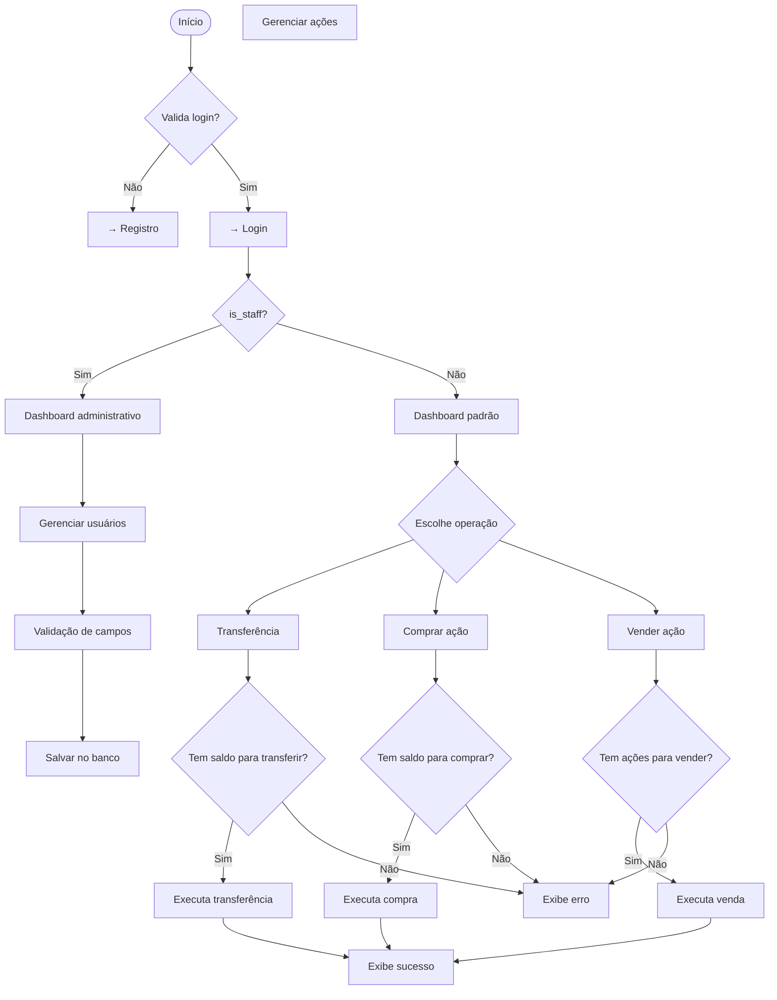

# 🧩 Controlasso

 ## 🚀 Guia de Contribuição do Projeto

Olá, equipe! 👋

Para mantermos nosso trabalho organizado e evitarmos problemas, criamos este guia rápido de como contribuir com o projeto usando **Git** e **GitHub**. Seguir estes passos vai facilitar a vida de todo mundo!

---

## ✅ Pré-requisitos para Contribuir com o Projeto

Antes de começar a trabalhar no projeto **Controlasso**, verifique se o seu ambiente está preparado com os seguintes requisitos:

---

## 🐍 Python 3.x

- Certifique-se de que o **Python 3.x** está instalado na sua máquina.
- Ele é necessário para:
  - Criar o ambiente virtual (`venv`)
  - Instalar as dependências listadas no `requirements.txt`

### Verifique sua versão do Python:

```bash
python3 --version
```

---

## 🧰 Git

- O **Git** é essencial para clonar o repositório, versionar seu código e colaborar com a equipe.

### Verifique sua instalação do Git:

```bash
git --version
```

---

## 🔐 Chave SSH configurada no GitHub

- Para clonar o repositório e enviar alterações com segurança, você precisa ter uma **chave SSH** configurada na sua conta do GitHub.

### Verifique se você já tem uma chave:

```bash
ls ~/.ssh
```

### Se ainda não tiver, siga este guia para gerar e adicionar sua chave ao GitHub:

🔗 [Como conectar-se ao GitHub com SSH (documentação oficial)](https://docs.github.com/pt/authentication/connecting-to-github-with-ssh)

---

Tudo pronto? Agora siga para a **configuração inicial**  🚀

---

## 🔧 Configuração Inicial (Faça isso apenas uma vez)

Antes de começar, você precisa preparar seu ambiente.

### 1. Clone o Repositório

Crie uma cópia do projeto na sua máquina:

```bash
git clone git@github.com:TLazari/Controlasso.git
cd Controlasso
```

### 2. Crie o Ambiente Virtual (venv)
Vamos isolar as dependências do nosso projeto para não bagunçar seu computador:

#### Crie a pasta do ambiente virtual (o .gitignore já está configurado para ignorá-la)

```bash
python3 -m venv venv
```

### 3. Ative o Ambiente Virtual
Sempre que for trabalhar no projeto, ative o ambiente:

#### Windows (CMD/PowerShell):

```bash
.\\venv\\Scripts\\Activate
```

#### Linux/macOS (bash):

```bash
source venv/bin/activate
```

Você saberá que funcionou quando vir (venv) no início do seu terminal.

### 4. Instale as Dependências
Com o ambiente ativado, instale as bibliotecas necessárias:

```bash
pip install -r requirements.txt
```
---
## Diagrama de Fluxo do Projeto




## 💻 Fluxo de Trabalho Diário (Para cada nova funcionalidade ou correção)
#### Este é o ciclo que você vai repetir toda vez que for programar algo novo.

‼️ PASSO ZERO: Mantenha-se Sincronizado! ‼️
Este é o passo mais importante para evitar conflitos. Antes de começar a escrever qualquer código, garanta que sua branch main local está atualizada com a do GitHub:

### 1. Volte para a branch principal

```bash
git switch main
```

### 2. Puxe as últimas atualizações do repositório remoto
```bash
git pull origin main
```
💡 Lembrete: Faça isso sempre antes de criar uma nova branch!

### 1. Crie uma Nova Branch
Nunca trabalhe diretamente na branch main. Crie uma branch separada.

### Crie e já mude para a nova branch
```bash
git switch -c seu-nome/descricao-da-tarefa
Padrão de nomes: seu-nome/o-que-voce-vai-fazer
```

Exemplos:

joao/tela-de-login

maria/correcao-bug-cadastro

ana/refatorar-banco-de-dados

### 2. Faça sua Mágica (Codifique e Teste)
Implemente suas alterações, codifique e teste tudo.

### 3. Salve seu Progresso (Add & Commit)
Quando terminar uma parte do trabalho (ou tudo), salve suas alterações:

#### 3.1. Adicione TODOS os arquivos modificados

```bash
git add .
```

#### Ou, se preferir, pode adicionar somente arquivos específicos:

```bash
git add caminho/do/arquivo
```

#### 3.2. Crie um commit com uma mensagem clara

```bash
git commit -m "feat: Adiciona o formulário de login com validação"
```

Boas mensagens de commit:

fix: Corrige o bug do botão de logout

docs: Atualiza o guia de contribuição

Referencia de boas mensagens: https://gist.github.com/joshbuchea/6f47e86d2510bce28f8e7f42ae84c716#file-semantic-commit-messages-md

### 4. Envie sua Branch para o GitHub (Push)

```bash
# Substitua pelo nome da SUA branch
git push origin seu-nome/descricao-da-tarefa
```

### 5. Crie um Pull Request (PR)
Vá até a página do projeto no GitHub.

Você verá um aviso amarelo com o nome da sua branch e um botão "Compare & pull request".

Clique nesse botão.

Escreva um título e uma breve descrição do que você fez.

Marque outros membros da equipe como revisores (Reviewers).

Clique em "Create pull request".

🎉 Pronto! Agora a equipe pode revisar seu código, sugerir melhorias e, quando tudo estiver certo, alguém integrará suas alterações à branch main.

Bons commits e boas contribuições! 💪🚀
